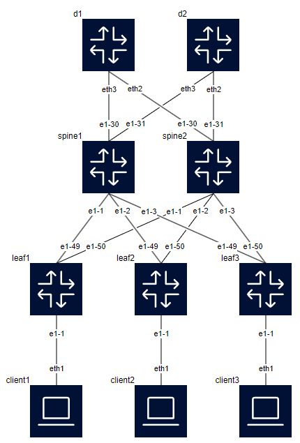
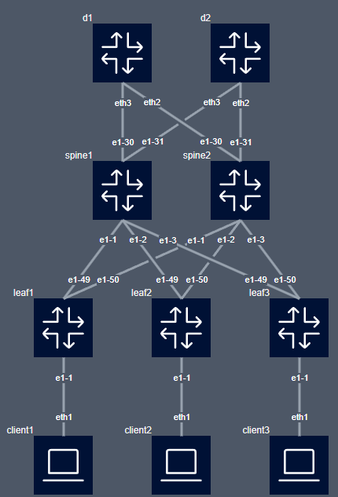
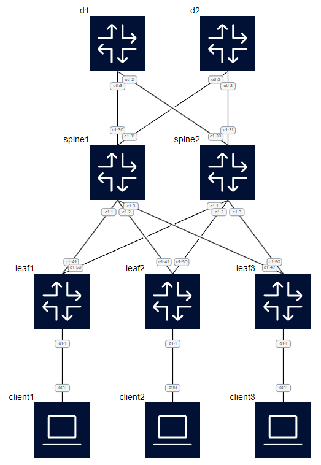
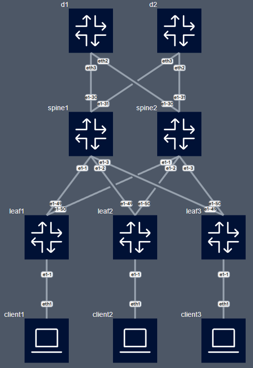
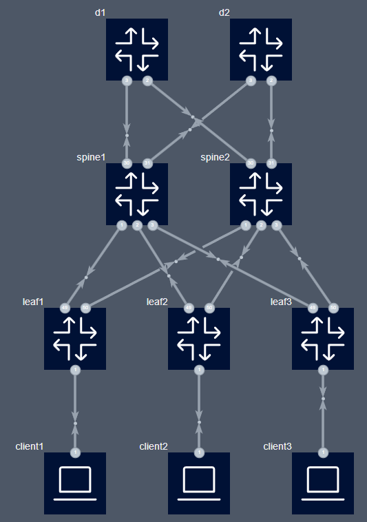

# clab2drawio

`clab2drawio` is a tool designed to automatically generate network topology diagrams from [Containerlab](https://github.com/srl-labs/containerlab) YAML files, rendering them into visually appealing diagrams using Draw.io. This tool simplifies the process of visualizing network designs and configurations, making it easier for network engineers and architects to document and share their containerlab environments.


## Features

- **Automatic Diagram Generation**: Converts containerlab YAML configurations into detailed Draw.io diagrams in vertical and horizontal layouts.
- **Automatic Node Placement**: Attempts to determine the best placement for nodes automatically. However, for complex topologies, this can be challenging.
- **Graph-level-Based Layout**: Organizes nodes into graph-level based on their connectivity for clearer topology visualization. Users can influence node placement by specifying graph-level directly in the containerlab configuration. Also possible with `-I` to set it interactive
- **Graph-icon Support**: Enhances node visualization by allowing users to specify graph-icon labels such as router, switch, or host to define custom icons for nodes in the generated diagrams.
- **Customizable Styles**: Supports customization of node and link styles within the diagrams.
- **Grafana Dahsboards**: Supports to autogenerate Grafana dashboards in Grafana style. (WIP)
 
  
  
  - For more detailed information about this feature, including compatibility, usage guidelines, and future enhancements, please see the [Grafana Dashboard Documentation](./grafana.md).

## Usage
To generate a network topology diagram from a containerlab YAML file, run the following command:

```bash
python clab2drawio.py -i <path_to_your_yaml_file> 
```
The output will be a Draw.io diagram file saved in the output path. In case without -o, the file will be saved in folder of the input file. You can open this file with Draw.io to view and further edit your network topology diagram.

## Advanced Usage

### Influencing Node Placement

The tool attempts to automatically determine the best placement for nodes. However, achieving an optimal layout for complex topologies might be challenging. You can influence node placement behavior through the `graph-level` and `graph-icon` labels in the containerlab file, which supports both vertical and horizontal layouts. The `graph-level` label impacts the placement of nodes along the primary axis of the chosen layout A lower `graph-level` number (e.g., `graph-level: 1`) indicates a position towards the start of the canvas, while a higher number places the node further along the primary axis. This feature allows you to suggest a specific hierarchy for each node, aiding the tool in organizing the topology more effectively.

Example configuration to set node graph-level:

```bash
client1:
  kind: "linux"
  labels:
    graph-level: 1 # This node will be placed towards the top of the canvas
    graph-icon: host # This node will use the client icon
```
```bash
spine1:
  kind: "linux"
  labels:
    graph-level: 2  # This node will be placed below graph-level 1 nodes on the canvas
    graph-icon: switch # This node will use the switch icon
```
Using graph-level helps manage the vertical alignment of nodes in the generated diagram, making it easier to visualize the hierarchical structure of your network.

### Command-Line Arguments

`clab2drawio` supports several command-line arguments to customize the diagram generation process. Use these arguments to fine-tune the output according to your specific requirements:

- `-i, --input`: Specifies the filename of the input file. This file should be a containerlab YAML for diagram generation. This argument is required.

    ```bash
    python clab2drawio.py -i <path_to_your_yaml_file>
    ```

- `-o, --output`: Specifies the output file path for the generated diagram in draw.io format. 

    ```bash
    python clab2drawio.py -i <path_to_your_yaml_file> -o <path_to_output_file>
    ```
- `-g, --gf_dashboard`: Generates a Grafana dashboard in Grafana style. (WIP)

    ```bash
    python clab2drawio.py -i <path_to_your_yaml_file> -g --theme grafana_dark
    ```

    For more detailed information about this feature, including compatibility, usage guidelines, and future enhancements, please see the [Grafana Dashboard Documentation](./grafana.md).

- `--include-unlinked-nodes`: Include nodes without any links in the topology diagram. By default, only nodes with at least one connection are included.

- `--no-links`: Do not draw links between nodes in the topology diagram. This option can be useful for focusing on node placement or when the connectivity between nodes is not relevant.

- `--layout`: Specifies the layout of the topology diagram (either `vertical` or `horizontal`). The default layout is `vertical`.

- `--theme`: Specifies the theme for the diagram (`nokia_bright`,  `nokia_dark`, or ... ) or the path to a custom style config file. By default, the `bright` theme is used. Users can also create their own style file and place it in any directory, specifying its path with this option. Feel free to contribute your own styles.

    ```bash
    python clab2drawio.py --theme nokia_dark -i <path_to_your_yaml_file>
    ```
    
    Or using a custom style file:

    ```bash
    python clab2drawio.py --theme <path_to_custom_style_file> -i <path_to_your_yaml_file>
    ```

- `-I`, `--interactive`: Define graph-levels and graph-icons in interactive mode

- `--verbose`: Enable verbose output for debugging purposes.


## Customization
The tool allows for customization of node and link styles within the generated diagrams, making it possible to adjust the appearance to fit specific requirements or preferences.

Below are some example images of the available custom styles:

<table>
  <tr>
    <td style="text-align: center;">
      <a href="img/nokia_bright.png" target="_blank">
        
      </a>
      <p>nokia_bright</p>
    </td>
    <td style="text-align: center;">
      <a href="img/nokia_dark.png" target="_blank">
        
      </a>
      <p>nokia_dark</p>
    </td>
  </tr>
  <tr>
    <td style="text-align: center;">
      <a href="img/modern_bright.png" target="_blank">
        
      </a>
      <p>nokia_modern_bright</p>
    </td>
    <td style="text-align: center;">
      <a href="img/modern_dark.png" target="_blank">
        
      </a>
      <p>nokia_modern_dark</p>
    </td>
  </tr>
  <tr>
    <td style="text-align: center;">
      <a href="img/grafana_dark.png" target="_blank">
        
      </a>
      <p>grafana_dark</p>
    </td>
  </tr>
</table>

**_NOTE:_**  drawio diagrams created with default_labels: true, cannot be used by drawio2clab

### Custom Styles
To customize styles, you can edit or copy the `nokia_bright.yaml` configuration file. This file defines the base style, link style, source and target label styles, and custom styles for different types of nodes based on their roles (e.g., routers, switches, servers).

An example snippet from `nokia_bright.yaml`:
```yaml
#General Diagram settings:
pagew: "auto"
pageh: "auto"

base_style: "shape=image;imageAlign=center;imageVerticalAlign=middle;labelPosition=left;align=right;verticalLabelPosition=top;spacingLeft=0;verticalAlign=bottom;spacingTop=0;spacing=0;"
link_style: "endArrow=none;jumpStyle=gap;"
src_label_style: "verticalLabelPosition=bottom;verticalAlign=top;align=left;spacingLeft=1;spacingTop=1;spacingBottom=0;"
trgt_label_style: "verticalLabelPosition=top;verticalAlign=bottom;align=left;spacingLeft=1;spacingTop=1;spacingBottom=0;"
custom_styles:
  default: "image=data:image/png;base64,..."
  spine: "image=data:image/png;base64,..."
  leaf: "image=data:image/png;base64,..."
  dcgw: "image=data:image/png;base64,..."
  server: "image=data:image/png;base64,..."
icon_to_group_mapping:
  router: "dcgw"
  switch: "leaf"
  host: "server"
```

### Applying Styles
Custom styles are applied to nodes and links based on the configurations specified in the style configuration files (`nokia_bright.yaml` for the bright theme and `nokia_dark.yaml` for the dark theme), located in the `styles` directory by default. To apply a new style to a node type, update its corresponding style definition in the appropriate YAML file. These styles determine the appearance of nodes and links in the generated diagram, including shapes, colors, and icons.

If you wish to create a completely new style, you can create a new YAML file with your custom configurations. This file can be placed in any directory, and you can specify its path when running the script using the `--theme` option.

### Advanced Styling
For users looking to further customize their diagrams with more advanced styling options, such as custom icons, specific dimensions, or additional visual attributes, you can directly edit the styles within the Draw.io interface.

To get the style data from Draw.io for a specific element:
1. Create or select the element in your Draw.io diagram.
2. Right-click on the element and select "Edit Style" from the context menu.
3. A style definition string will be displayed in a text box. You can copy this string and incorporate it into your custom style file or directly modify it within Draw.io for immediate effect.


