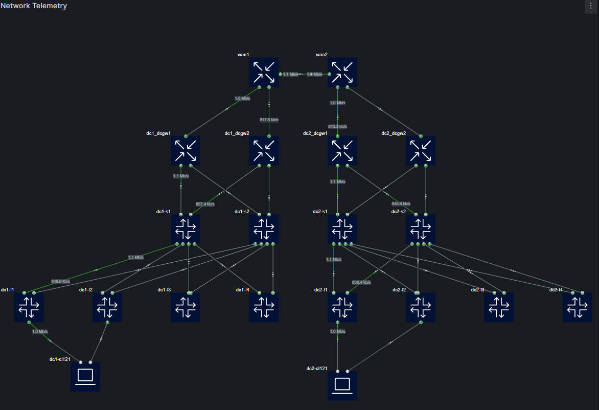

### Grafana Dashboard Generation Option

The `-g, --gf_dashboard` command line option is designed to automate the generation of Grafana dashboards with all it's rules from your YAML configuration files. When using this option, it is important to note the following specifics:

<p align="center">
  
</p>


> [!IMPORTANT]
> - **Draw.io version** The flow panel is currently broken with draw.io version 26.0.x ( it works with previous releases )
> - **Grafana Version:** This feature works optimally with Grafana versions **>10.0.0**. Recommendation: **11.2.0**.  
> - **Plugin Requirement:** Requires the [Flow plugin](https://grafana.com/grafana/plugins/andrewbmchugh-flow-panel). This plugin is essential for rendering the custom visualizations generated by the script.

## Features

- **Link Monitoring**: Displays link utilization and status (up/down) in a color-coded manner.
- **Port Monitoring**: Displays node port statuses (red/green).
- **Prometheus Integration**: Built for use with common streaming telemetry data 
  (e.g., from `gnmic`).

### Usage
To generate a dashboard, execute the following command:
```bash
uv run python clab2drawio.py -i <path_to_your_yaml_file> -g --theme grafana
```
> [!TIP]
> Use a Grafana-compatible theme like `grafana` for a more cohesive look.

### Output

When `-g` is used, the script generates:

1. A **Grafana dashboard JSON** file.
2. A **Panel YAML** configuration file 
3. A **Draw.io diagram**.

> [!NOTE]
> The drawio diagram needs to be exported to svg, see below
   
### Additional Options


The `--grafana-config` option lets you customize Grafana Flow Panel settings. If omitted, the default configuration is used.

> [!NOTE]  
> - **Targets:** Defines Prometheus queries and legends (e.g., operational state, traffic rates).  
> - **Thresholds:** Preconfigured color coding:  
>   - `operstate`: Red (down), Green (up).  
>   - `traffic`: Gray (low), Green (normal), Yellow/Orange/Red (high).  
> - **Label Config:** Units (`bps`), decimal precision (1), and value mappings.

To use a custom configuration:
```bash
uv run python clab2drawio.py -i <path_to_yaml> -g --theme grafana --grafana-config <path_to_config>
```

> [!TIP]  
> Customize targets, thresholds, or labels in your YAML to align with your network's metrics and visualization needs.

#### To export the diagram as an SVG:
To get a full guide: [https://github.com/andymchugh/andrewbmchugh-flow-panel/blob/main/src/README.md#using-drawio-to-create-your-svg](https://github.com/andymchugh/andrewbmchugh-flow-panel/blob/main/src/README.md#using-drawio-to-create-your-svg)

> [!IMPORTANT]
> The svgdata plugin needs to be enabled
>
> ⚠️ Due to breaking changes in draw.io 26.0.x ([Issue #127](https://github.com/andymchugh/andrewbmchugh-flow-panel/issues/127)), please use draw.io desktop app version 25.x or lower

> [!NOTE]
> The generated dashboard JSON will include the panel configuration but without the SVG data. To complete the dashboard, you need to either:
> - Copy and paste the SVG data into the designated SVG box in the Grafana dashboard editor.
> - Upload the SVG file to a hosting service and reference the URL in the Grafana dashboard editor.

By following these steps, you can generate a complete Grafana dashboard with the diagram, panel configuration, and dashboard JSON file.

#### Current Limitations
- **Data Sources:** The dashboard assumes specific data sources (Prometheus) are already configured in your Grafana instance that align with the hardcoded queries.

<details>
<summary><b>Recommended gnmic.yaml Configuration for SROS and SRL</b> (Click to expand)</summary>


```yaml
username: admin
password: *******
insecure: true
log: true

common_sros_subscriptions: &common_sros_subs
  insecure: true
  password: ******
  subscriptions:
      - sros-if-stats
      - sros-bgp-stats
      - sros-service-stats

common_srl_subscriptions: &common_srl_subs
  port: 57400
  skip-verify: true
  insecure: false
  password: *******
  subscriptions:
      - srl-if-stats 
      - srl-bgp
      - srl-system-performance
      - srl-routes
      - srl-bridge
      - srl-apps
      - srl-net-instance

targets:
  dc1-l1: *common_srl_subs
  dc1-l2: *common_srl_subs
  dc1-l3: *common_srl_subs
  dc1-l4: *common_srl_subs
  dc1-s1: *common_srl_subs
  dc1-s2: *common_srl_subs
  dc2-l1: *common_srl_subs
  dc2-l2: *common_srl_subs
  dc2-l3: *common_srl_subs
  dc2-l4: *common_srl_subs
  dc2-s1: *common_srl_subs
  dc2-s2: *common_srl_subs
  wan1: *common_sros_subs
  wan2: *common_sros_subs
  dc1_dcgw1: *common_sros_subs
  dc2_dcgw2: *common_sros_subs
  dc2_dcgw1: *common_sros_subs
  dc1_dcgw2: *common_sros_subs

subscriptions:
  ## SROS ###
  sros-if-stats:
    paths:
      - /state/port[port-id=*]/oper-state
      - /state/port[port-id=*]/ethernet/statistics
    mode: stream
    stream-mode: sample
    sample-interval: 1s
            
  sros-bgp-stats:
    paths:
      - /state/router[router-name=*]/bgp/statistics/peers
      - /state/router[router-name=*]/bgp/neighbor[ip-address=*]/statistics/session-state
      - /state/router[router-name=*]/bgp/neighbor[ip-address=*]/statistics/family-prefix/ipv4
      - /state/router[router-name=*]/bgp/neighbor[ip-address=*]/statistics/family-prefix/evpn
    mode: stream
    stream-mode: sample
    sample-interval: 5s

  sros-service-stats:
    paths:
      - /state/service/vpls[service-name=*]/oper-state
      - /state/service/vprn[service-name=*]/oper-state
    mode: stream
    stream-mode: sample
    sample-interval: 5s


  srl-system-performance: 
    mode: stream
    stream-mode: sample
    sample-interval: 5s
    paths: 
      - /platform/control[slot=*]/cpu[index=all]/total
      - /platform/control[slot=*]/memory
  srl-if-stats:
    mode: stream
    stream-mode: sample
    sample-interval: 3s
    paths: 
      - /interface[name=ethernet-1/*]/oper-state
      - /interface[name=ethernet-1/*]/statistics
      - /interface[name=ethernet-1/*]/traffic-rate
  srl-routes:
    mode: stream
    stream-mode: sample
    sample-interval: 5s
    paths:
      - /network-instance[name=*]/route-table/ipv4-unicast/statistics/
      - /network-instance[name=*]/route-table/ipv6-unicast/statistics/
  srl-bgp:
    mode: stream
    stream-mode: sample
    sample-interval: 5s
    paths:
      - /network-instance[name=*]/protocols/bgp/statistics
  srl-bridge:
    mode: stream
    stream-mode: sample
    sample-interval: 5s
    paths:
      - /network-instance[name=*]/bridge-table/statistics/
  srl-apps:
    paths:
      - /system/app-management/application[name=*]
    mode: stream
    stream-mode: sample
    sample-interval: 5s
  srl-net-instance:
    paths:
      - /network-instance[name=*]/oper-state
    mode: stream
    stream-mode: sample
    sample-interval: 5s

outputs:
  prom-output:
    type: prometheus
    #listen: "gnmic:9804"
    listen: :9273
    # export-timestamps: true
    #service-registration:
    #  address: consul:8500
    event-processors:
     - trim-prefixes
     - rename-port-sros
     - rename-port-value-sros
     - rename-srl-interface
     - oper-state-to-int

processors:
  trim-prefixes:
    event-strings:
      value-names:
        - "^/state/.*"
      transforms:
        - trim-prefix:
            apply-on: "name"
            prefix: "/state/"

  oper-state-to-int:
    event-strings:
      value-names:
        - ".*"
      transforms:
        - replace:
            apply-on: "value"
            old: "up"
            new: "1"
        - replace: 
            apply-on: "value"
            old: "down"
            new: "0"   
  rename-port-sros:
    event-strings:
      tag-names:
        - "^port_port-id"
      transforms:
        - replace:
            apply-on: "name"
            old: "port_port-id"
            new: "interface_name"
  rename-port-value-sros:
    event-strings:
      tag-names:
        - "^interface_name"
      transforms:
        - replace:
            apply-on: "value"
            old: ".*/c(\\d+)(/\\d+)?"
            new: "eth$1"
  rename-srl-interface:
    event-strings:
      tag-names:
        - "^interface_name"
      transforms:
        - replace:
            apply-on: "value"
            old: "ethernet-(\\d+)/(\\d+)"
            new: "e$1-$2"
```
</details>

## Further Documentation & References

- [Containerlab Documentation](https://containerlab.dev)
- [clab2drawio.md](./clab2drawio.md)
- [drawio2clab.md](./drawio2clab.md)
- [grafana.md](./grafana.md)
