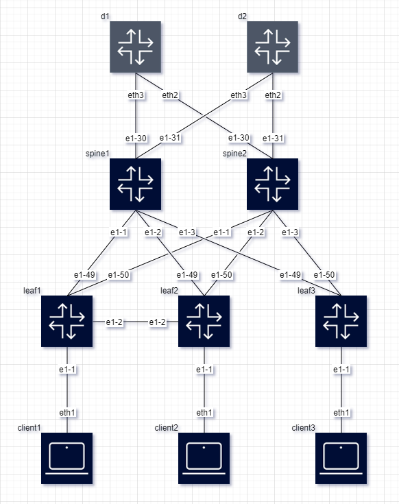

# Drawio2Clab

Drawio2Clab is a tool that converts .drawio diagrams to YAML format, specifically designed for network topologies. It parses XML files exported from draw.io (or diagrams.net), extracts information about nodes and links, and generates a structured YAML representation of the network. This process streamlines the setup of complex network topologies within [Containerlab](https://github.com/srl-labs/containerlab) environments, facilitating an easy and efficient way to manage container-based networking labs.

## Features

- Converts .drawio diagrams to Containerlab-compatible YAML.
- Allows selection of specific diagrams within a .drawio file.
- Supports block and flow styles for YAML endpoints.
- Extracts detailed node and link information for precise topology representation.

## Drawing Constraints

When creating your .drawio diagrams, please adhere to the following constraints to ensure successful conversion:

- **Node Labeling**: All nodes must be labeled. To label a node, click on the node and start typing.
  
- **Link Labeling**: All links need to be labeled. To label a link, double-click on the link and type your label. Only the labels closest to the source and destination will be considered.
  
### Adding Node Data
In addition to labeling, nodes can contain additional data to further define the network configuration. The following attributes can be added to a node:

- `type`: Specify the type of the node. E.g., "ixrd2", "ixrd3".
- `kind`: Specify the kind of the node, by default nokia_srlinux
- `mgmt-ipv4`: Assign a management IPv4 address to the node.
- `group`: Define a group to which the node belongs.
- `labels`: Add custom labels for additional metadata or categorization.

To add these attributes to a node, select the node and add custom properties in the format `<property_name>=<value>`. Ensure each attribute is properly formatted according to the capabilities of draw.io for defining custom properties.

Those attributes will be added to the clab nodes.



The above image demonstrates how to correctly label nodes and links and add additional data to nodes for conversion.


## Usage
Convert a .drawio file to YAML:

```bash
python drawio2clab.py -i input_file.xml -o output_file.yaml
```

Specify a diagram name and output style:

```bash
python drawio2clab.py -i input_file.xml -o output_file.yaml --diagram-name "Diagram 1" --style flow
```

### Arguments
- -i, --input: Input .drawio XML file.
- -o, --output: Output YAML file.
- --style: YAML style (block or flow). Default is block.
- --diagram-name: Name of the diagram to parse.